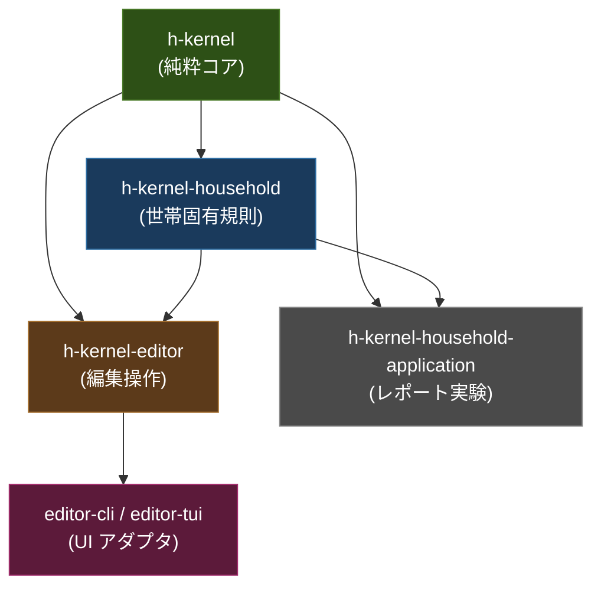

# h-kernel アーキテクチャ＆コード品質レビュー

> **レビュー日**: 2026-08-07  
> **対象**: [h-kernel](file:///Users/user/Projects/moko/h-kernel) リポジトリ全体  
> **ソース**: ~42 src + 14 editor-src + 10 household-src + 3 spike-src = **~70 .hs** / テスト **48 Spec**

---

## 総合評価

| 領域 | 評点 | 一言 |
|---|---|---|
| **アーキテクチャ設計** | ★★★★★ | 教科書的「純粋コア＋命令的シェル」、4内部ライブラリで依存方向を構造的に強制 |
| **型設計** | ★★★★★ | Parse, Don't Validate の徹底。不正状態が型で排除される |
| **関数合成** | ★★★★★ | 品の良い point-free、Semigroup/Monoid/Foldable の一貫した活用 |
| **エラー処理** | ★★★★★ | 巨大な `JournalErrorReason` ADT 等、文脈豊富な型付きエラー |
| **モジュール構成** | ★★★★★ | 明示的 export、スマートコンストラクタ、ファサードパターン |
| **命名規約** | ★★★★★ | ドメイン語彙に忠実、moduleNameField 接頭辞で衝突回避 |
| **DRY** | ★★★★½ | Semigroup instance で重複排除。レポート描画に微少な類似 |
| **型安全性** | ★★★★★ | newtype 状態遷移、PositiveAmount、隠蔽コンストラクタ |
| **副作用管理** | ★★★★★ | IO は `Loader` の `StateT LoadedFiles (ExceptT LoadError IO)` のみ |
| **テスト** | ★★★★★ | 48 独立スイート、代数法則の QuickCheck、fixture/corpus/golden |
| **ビルド・CI** | ★★★★★ | 3 GHC バージョン(9.10, 9.12, 9.14)、`-Wall -Werror=incomplete-patterns` |
| **フォーマット一貫性** | ★★★★★ | 全ファイルで完全統一 |
| **依存関係** | ★★★★★ | 最小限。重量級フレームワーク不使用 |
| **ドキュメント体系** | ★★★★★ | 21 正規文書を INDEX.toml で追跡、repository-audit で強制 |
| **ソースコード内文書** | ★★★★☆ | Haddock あり。一部モジュールで拡充の余地 |

> [!IMPORTANT]
> **総合**: 例外的に高品質な Haskell コードベース。ドメインモデリング・型安全性・テスト戦略・ビルドインフラが高水準で統合されている。

---

## 1. アーキテクチャ

### パッケージ構造 — 4 内部ライブラリ

[`h-kernel.cabal`](file:///Users/user/Projects/moko/h-kernel/h-kernel.cabal) が定義する構造:



| ライブラリ | ソースディレクトリ | 役割 | IO |
|---|---|---|---|
| `h-kernel` | `src/` (~42 files) | 純粋コア: 勘定、元帳、仕訳帳、報告、描画基盤 | なし（`Loader` 除く） |
| `h-kernel-household` | `household-src/` | 世帯固有: 予算、日次目標、勘定プロファイル、pure Report composition/rendering | なし |
| `h-kernel-household-application` | `household-app-src/` | canonical Household IO、typed admission、write snapshot、Report bootstrap | 読込み |
| `h-kernel-editor` | `editor-src/` (~14 files) | 編集: 型付き編集意図、プレビュー、安全な原子的書込み | 書込みのみ |

**依存方向は Cabal の内部ライブラリ境界で構造的に強制**される。`h-kernel` コアが editor や household を知ることはビルドシステムレベルで不可能。

### ソースモジュール階層

```
src/HKernel/
├── Account/          ← 勘定定義・仕訳帳
├── Actual/           ← 実取引仕訳帳
├── Application/      ← アプリ設定
├── Budget/           ← 消費・配分・権利・履歴・政策・経路
├── Engine/           ← ファクト準備・クエリインターフェース
├── Envelope/         ← 封筒予算概念
├── HouseholdIssue/   ← 問題描画
├── Plan/             ← 計画予約・完了・仕訳帳
├── Render/           ← 端末スタイリング・出力
└── Report/           ← 設定・行列・各種帳票
```

### 副作用の隔離

[`Loader.hs`](file:///Users/user/Projects/moko/h-kernel/src/HKernel/Loader.hs) が唯一の IO 境界:

```haskell
type Loader = StateT LoadedFiles (ExceptT LoadError IO)
```

- ファイル include グラフを解決し、循環を検出
- 解析は純粋関数に委任
- `Journal.hs`, `Report.hs`, `Ledger.hs`, `Engine.hs` は **100% 純粋**

---

## 2. 型設計の美しさ

### 「Parse, Don't Validate」の徹底

#### Balance — 正規形の自動維持

[`Money.hs`](file:///Users/user/Projects/moko/h-kernel/src/HKernel/Money.hs):

```haskell
-- Balance = Map Commodity Quantity
-- スマートコンストラクタがゼロ値を自動的に刈り込み、正規表現を維持
```

`Balance` は `Semigroup` instance を持ち、`fold` で合成可能。ゼロ項目が内部に残ることはない。

#### Transaction — 複式不変条件の構築時保証

[`Ledger.hs`](file:///Users/user/Projects/moko/h-kernel/src/HKernel/Ledger.hs):

```haskell
mkTransaction :: ... -> Either TransactionError Transaction
-- ① NonEmpty Posting (1+ 保証)
-- ② mkTransaction が 2+ 件を要求
-- ③ 各 Commodity の合計がゼロであることを検証
-- ④ Transaction コンストラクタは隠蔽
```

> [!TIP]
> **改善案**: `NonEmpty Posting` は 1+ を保証するが、`mkTransaction` は 2+ を要求する。`data Postings = Postings Posting Posting [Posting]` のような型で 2+ を構造的に保証できる可能性がある。

#### Plan — newtype 状態遷移

[`Plan.hs`](file:///Users/user/Projects/moko/h-kernel/src/HKernel/Plan.hs):

```haskell
newtype PositiveAmount = ...     -- 金額 > 0
data PaymentDirection = ...
data DeclaredPaymentDirection = ...
data DeclaredOutgoingPaymentDirection = ...
```

状態遷移を newtype の連鎖で表現。GADTs や Phantom 型を使わずとも、隠蔽コンストラクタと newtype の組み合わせで安全な状態機械を実現。

#### Journal — 網羅的エラー型

[`Journal.hs`](file:///Users/user/Projects/moko/h-kernel/src/HKernel/Journal.hs):

```haskell
data JournalErrorReason
  = PostingCommodityMismatch Account Commodity Commodity
  | ...
  -- 20+ コンストラクタで全てのエラー文脈を保持
```

文字列エラーは一切なし。すべてのエラーが構造化された型で文脈情報を持つ。

---

## 3. テスト戦略

### 48 独立テストスイート

各 `*Spec.hs` が独立した `test-suite` stanza として Cabal に宣言され、**並列実行・隔離実行**が可能。

### 代数法則の Property Test

[`BalanceLawSpec.hs`](file:///Users/user/Projects/moko/h-kernel/tests/BalanceLawSpec.hs):

```haskell
propSemigroupAssociative :: Balance -> Balance -> Balance -> Bool
propMonoidLeftIdentity   :: Balance -> Bool
propBalanceCommutative   :: Balance -> Balance -> Bool
```

**ドメインの代数的法則が QuickCheck プロパティとして検証される**。

### ドメイン固有の厳密テスト

[`ActualJournalSpec.hs`](file:///Users/user/Projects/moko/h-kernel/tests/ActualJournalSpec.hs):

```haskell
rejectReversalWithoutEventIdentity  -- 取消の恒等律違反を拒否
```

### テストデータ体系

| 種類 | 場所 | 用途 |
|---|---|---|
| インラインテキスト | `*Spec.hs` 内 | ドメインロジック単体検証 |
| Fixture | `tests/fixtures/` | 構造化テストデータ |
| Corpus | `tests/corpus/` | スナップショットテスト |
| Golden | `tests/golden/` | レポート出力の黄金ファイル |

---

## 4. インフラストラクチャ

### ビルドシステム

| 項目 | 内容 |
|---|---|
| cabal-version | 3.0 |
| GHC | 9.10.3, 9.12.4, 9.14.1 (CI で検証) |
| 警告 | `-Wall -Werror=incomplete-patterns` |
| 言語 | GHC2021 (推定) |
| テスト | ~25 独立 `test-suite` stanza |

### CI (GitHub Actions)

[`.github/workflows/ci.yml`](file:///Users/user/Projects/moko/h-kernel/.github/workflows/ci.yml):

```
Build → Test → Repository Audit → Report Verify (fixture)
```

3 つの GHC バージョンでマトリクステスト。

### カスタムツーリング

| ツール | 場所 | 用途 |
|---|---|---|
| `repository-audit` | [`tools/repository-audit/`](file:///Users/user/Projects/moko/h-kernel/tools/repository-audit/) | INDEX.toml との整合性、リポジトリ衛生の自動検証 |
| `report-build` | ルート | 最適化バイナリビルド → `.report-bin/` |
| `report-verify` | ルート | golden ファイルとの差分検証 |
| `report-snapshot` | ルート | スナップショット更新 |
| `report-benchmark` | ルート | パフォーマンス計測 |
| `report_sections.py` | `tools/` | テキスト出力操作 |
| `verify_report_corpus.py` | `tools/` | corpus アサーション管理 |

### 依存関係

| パッケージ | 用途 |
|---|---|
| `base`, `containers`, `text`, `time`, `transformers` | 基盤 |
| `scientific` | 正確な十進数演算 |
| `toml-parser` | 設定ファイル |
| `brick`, `vty`, `microlens` | TUI (editor-tui のみ) |

**重量級フレームワーク不使用** — lens (full), mtl, template-haskell, aeson 等は依存に含まれない。

---

## 5. 特筆すべき美点

### ① ドメインと Haskell の精密な対応

| ドメイン概念 | Haskell 表現 |
|---|---|
| 複式仕訳の均衡 | `mkTransaction` スマートコンストラクタ + 隠蔽コンストラクタ |
| 残高の正規形 | `Balance` の `Semigroup` + ゼロ自動刈込み |
| 金額の正値性 | `PositiveAmount` newtype |
| 仕訳帳エラー文脈 | 20+ コンストラクタの `JournalErrorReason` ADT |
| 勘定取消の恒等律 | `rejectReversalWithoutEventIdentity` テスト |
| ファイル読込のエフェクト | `StateT LoadedFiles (ExceptT LoadError IO)` |
| 予算配分ロジック | 純粋関数の合成 |

### ② 規律あるスケール

~70 Haskell ソースファイルに対して 48 テストスイート（約 0.7 テスト/ソース比）。テストは量ではなく、**代数法則とドメイン不変条件の検証**に集中している。

### ③ 文書体系の構造的強制

[`docs/INDEX.toml`](file:///Users/user/Projects/moko/h-kernel/docs/INDEX.toml) が 21 正規文書を追跡し、[`repository-audit`](file:///Users/user/Projects/moko/h-kernel/tools/repository-audit/) が CI で整合性を検証する。文書の散逸を構造的に防いでいる。

### ④ 副作用境界の明瞭さ

IO を持つモジュールは `Loader.hs` と Editor の `Writer.hs` のみ。コア会計ロジック、報告ロジック、予算ロジックは完全純粋で、テスト容易性と推論容易性を保証する。

### ⑤ Editor の安全な書込みライフサイクル

```
候補準備 → 厳密受理 → 陳腐化チェック → 原子的書込み
```

書込みの前に多段階検証を行い、`actual.journal` への単一ライター権限を型と手順の両方で保護する。

---

## 6. 改善の余地

> [!NOTE]
> いずれも微調整レベルの指摘であり、構造的問題ではない。

### 6.1 Posting 数の型レベル保証

`NonEmpty Posting` は 1+ だが `mkTransaction` は 2+ を要求。型で 2+ を強制する余地がある:

```haskell
data Postings = Postings Posting Posting [Posting]
```

### 6.2 フォーマッタ設定の明示化

明示的な `fourmolu.yaml` / `.ormolu` 設定ファイルが見当たらない。フォーマットの一貫性は維持されているが、設定を明文化すると新規貢献者に優しい。

### 6.3 HLint の CI 統合

HLint 設定が見当たらず、CI での lint 検証も未確認。`repository-audit` がカバーしている可能性はあるが、HLint の追加は追加の安全網になる。

### 6.4 一部モジュールの Haddock 拡充

公開 API の主要関数には Haddock があるが、内部ヘルパーやモジュールレベルの Haddock が薄い箇所がある。

### 6.5 Editor 層の型精度

Editor 関連モジュールの一部で `Text` の直接使用がやや多い。ドメイン固有 newtype の導入を検討可能。

---

## 7. 結論

h-kernel は、**Haskell によるドメインモデリングの模範**と呼べるコードベースである。

- **型が嘘をつかない** — スマートコンストラクタと隠蔽コンストラクタで不正状態を排除
- **代数が業務規則を表す** — `Balance` の `Semigroup`、`Transaction` の均衡不変条件
- **副作用が名前を持つ** — `Loader` モナドスタック、Editor の書込みライフサイクル
- **テストが法則を検証する** — QuickCheck による結合律・単位律・可換律
- **文書が構造的に強制される** — `INDEX.toml` + `repository-audit`

改善点は Posting 型の精密化、フォーマッタ設定の明文化、Haddock の拡充など、いずれも**高品質なコードベースをさらに磨く**レベルの指摘であり、アーキテクチャや設計思想に構造的な問題は見当たらない。
