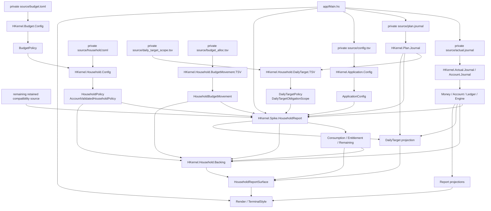

# h-kernel コードスコア

ステータス: アクティブな全体設計面  
更新日: 2026-08-06

## 1. この文書の役割

この文書は、`h-kernel`というリポジトリ全体を一度に眺めるためのスコアである。

現在どの声部が存在し、事実、policy、計算、Report、表示、運用がどのように受け渡されているかを示す。同時に、各場所をどのようなコードへ育てたいか、まだ確定していない構成や短いコード案を鉛筆書きできる面でもある。

この文書が所有するのは次である。

- リポジトリ全体の現在の編成
- component、module群、source、toolのあいだを渡る主要な流れ
- 各領域に望む質感と育てる方向
- 全体を見ながら検討する設計スケッチと未解決の問い

この文書は、個別の厳密な契約を置き換えない。

- 会計上の不変条件と依存方向は[`ARCHITECTURE.md`](ARCHITECTURE.md)
- リポジトリ運用と文書寿命は[`REPOSITORY_POLICY.md`](REPOSITORY_POLICY.md)
- source、policy、Report、writer authorityの詳細は、それぞれの正規owner文書
- 公開データ境界は[`../SECURITY.md`](../SECURITY.md)

コードスコアは全体の関係を所有し、各partの契約はそのpartのownerが所有する。

## 2. 譜面上の記号

この文書では、現在と下書きを混同しないために四つの状態を使う。

| 記号 | 意味 |
|---|---|
| **CURRENT** | `main`に実装され、現在のsource、build、test、文書から確認できる状態 |
| **DIRECTION** | 作者と合意した、育てたい性質または構成の方向 |
| **SKETCH** | 比較や実験のための未決定案。実装契約ではない |
| **QUESTION** | 全体を見たときに残っている問い。答えを推測で埋めない |

`SKETCH`は、コードへmergeされた時点で初めて`CURRENT`になり得る。採用しない案や役目を終えた案は通常文書へ堆積させず、削除してGit履歴へ戻す。

## 3. 現在の編成

### Top-level score

| 場所 | CURRENTの役割 | 現在の状態 |
|---|---|---|
| `src/` | 正確な会計核、Journal、Plan、Budget、Report、application config admission、表示primitiveを所有するmain library | stable |
| `household-src/` | Household policy、Daily Target、Household Backing、source-independentな家計factと名前付きadmission | stable component |
| `spike-src/` | typed sourceと残るcurrent-format sourceを合成してHousehold Reportを作るread-only adapter | active spike |
| `app/` | ファイル、環境、標準入出力、終了状態を扱い、pureな値を接続する実行境界 | IO shell |
| external private source | 正規の世帯fact、policy、移行中の互換source | canonical + transitional, not tracked |
| `tests/` | module、component、Report surface、repository ownershipの観察可能な契約 | verification |
| `tools/` | repository audit、公開ledger検証など、リポジトリを外側から点検する装置 | operations |
| `docs/` | policy、architecture、contract、observationと、この全体スコア | documentation |
| repository root | build metadata、共通作業入口、Report実行script、公開境界の入口 | coordination surface |

### Cabal components

```text
h-kernel
  source: src/
  owns: accounting, Journal, Plan, Budget, Report,
        application source selection, rendering primitives

h-kernel-household
  source: household-src/
  depends on: h-kernel
  owns: HouseholdPolicy, DailyTarget, HouseholdBacking,
        HouseholdBudgetMovement, and their admissions

h-kernel-spike-household-report
  source: spike-src/
  depends on: h-kernel + h-kernel-household
  owns: provisional Household Report composition

h-kernel executable
  source: app/
  owns: IO shell and command entry
```

## 4. CURRENT: 全体のデータと計算の流れ



この図は全体の受け渡しを示すスコアであり、各parserやReportの完全なcall graphではない。詳細な現在契約は、それぞれのowner文書と型signatureを読む。

## 5. CURRENTとDIRECTION: 各声部

### 5.1 正確な会計核

**CURRENT**

- `HKernel.Money`がCommodityごとの正確なQuantityとBalanceを所有する
- `Balance`は結合律、単位元、可換性、加法逆元、zero normalizationを持つ組合せとして`Semigroup` / `Monoid`を公開する
- `HKernel.Account`がAccount identityとRegistryを所有する
- `HKernel.Ledger`がPostingと均衡したTransactionを所有する
- `HKernel.Engine`と`HKernel.Engine.Facts`がReportへ渡す集計factを構築する

**DIRECTION**

正確さだけを孤立した硬さにしない。小さな型、名前のある変換、組み合わせ可能な値が互いを支え、入力からReportまで意味を失わず流れる核にする。

### 5.2 Source admission

**CURRENT**

- Actual、Account、Planには名前付きJournal admissionがある
- `HKernel.Application.Config`がretained `config.tsv`から検証済みのapplication source selectionを作る
- BudgetとHousehold policyにはTOML admissionがある
- retained `daily_target_scope.tsv`には、物理rowをpolicy、obligation selection、reservation declarationへ分ける名前付きadmissionがある
- `HKernel.Household.BudgetMovement`が日付、memo、from／to Account、Amountをsource形状から独立したfactとして所有する
- `HKernel.Household.BudgetMovement.TSV`がretained `budget_alloc.tsv`をそのfactへadmitする
- parserは生text、行位置、診断を保持し、invalidな値を後段へ黙って流さない
- `accounts.tsv`のcurrent-format admissionだけがHousehold Report Spikeに残る

**DIRECTION**

人間が書くtextの揺れ、移行中のfile形状、厳密なdomain admissionは、同じ質感へ均さない。それぞれの難しさを適切な境界で受け止め、後段には検証済みの意味を渡す。

### 5.3 BudgetとHousehold policy

**CURRENT**

- `HKernel.Budget.Config`が`budget.toml`から一般`BudgetPolicy`を作る
- `HKernel.Household.Config`が`household.toml`の家計固有座標を重ねる
- `HKernel.Household.Policy`がCycle、公開順、allocation Account、追加Plan destination、未割当範囲を所有する
- Consumption、Entitlement、Remainingはmain libraryの名前付きownerにある

**DIRECTION**

事実、選択されたpolicy、検証済みpolicy、導出結果を別の声部として保ち、暗黙の推測や同じsourceの再解釈を計算の途中へ持ち込まない。

### 5.4 Daily Target

**CURRENT**

- `HKernel.Household.DailyTarget`がeligible Asset policy、current-cycle obligation scope、reservation evidence、Daily Target projectionを所有する
- eligible Asset Accountはcanonical `AccountRegistry`でAssetとして検証される
- outgoing Plan selectionはPlan identityで解決され、reservation relationは`HKernel.Plan.Reservation`へ委譲される
- eligible assets、open obligations、already excluded amountはそれぞれ`Balance`へ`foldMap`される
- `DailyTarget`は最終rateだけでなく、観察日、cycle終端、三つの集計証拠を保持する
- 詳細は[`DAILY_TARGET_POLICY.md`](DAILY_TARGET_POLICY.md)が所有する

**DIRECTION**

「今日使える額」を一つのmagic numberにせず、長寿命policy、cycleごとの選択、関係証拠、時間座標、導出結果を別々に読める判断面として育てる。

### 5.5 Household Backing

**CURRENT**

- `HKernel.Household.Backing`がEnvelope claim、policy指定Asset funding、unassigned Budget evidence、open Plan reserveを一つの観察として所有する
- `HKernel.Household.BudgetMovement.TSV`がretained sourceをsource-independent movementへadmitする
- `HouseholdBudgetMovement`により、Backing計算は`budget_alloc.tsv`の列形状を知らない
- Signed Totalはoverspent Envelopeを負のまま保持する
- Backing Requiredは正のEnvelope claimだけをCommodityごとに`foldMap`する
- Backing SurplusとReconciliation Deltaはfunding、required、unassigned Budgetを別の座標として計算する
- 詳細は[`HOUSEHOLD_BACKING.md`](HOUSEHOLD_BACKING.md)が所有する

**DIRECTION**

Backingを単一の可否判定や資金移動命令にせず、何がclaimで、何がfundingで、何が未割当で、何が将来Plan reserveかを説明できる家計観察として育てる。

### 5.6 Household Report composition

**CURRENT**

- `HKernel.Spike.HouseholdReport`がstable ownerとcurrent-format sourceを合成する
- application configはmain library、Household policy、Daily Target、Household Backing、Budget movement admissionはstable Household componentにある
- `accounts.tsv`のsource-specific admissionだけがSpikeに残る
- writer authorityは移行しておらず、Report経路はread-onlyである

**DIRECTION**

暫定境界に残る責任を一つずつ名前付きownerへ移し、必要な意味が揃った時点でstable Household componentへReport compositionを移す。Spikeという名前だけを消すための移動はしない。

### 5.7 Reportと表示

**CURRENT**

- `HKernel.Report`と`HKernel.Report.*`が会計Report projectionを所有する
- `HKernel.Render`と各domain render moduleがtext surfaceを構築する
- `HKernel.Render.TerminalStyle`がANSIと文字幅などterminal固有の物理を扱う

**DIRECTION**

計算結果、Reportの意味、sectionの構成、terminalの物理を分けながら、最終的な表示を断片の寄せ集めにしない。表、見出し、注記、状態が一つの読みやすい構成として響く形を探る。

### 5.8 Testと運用装置

**CURRENT**

- focused testとfull testが型付きownerの振る舞いを観察する
- `h-kernel-application-config-test`がsource selection、line coordinate、未知key、last-write-wins互換を観察する
- `h-kernel-balance-law-test`がBalanceの代数法則をmulti-commodityな生成値で観察する
- `h-kernel-daily-target-test`がpolicy、obligation selection、reservation、時間付きprojectionを別々に観察する
- `h-kernel-household-backing-test`がsigned claim、positive required、funding surplus、unassigned reconciliation、Plan reserveを別々に観察する
- `h-kernel-household-budget-movement-tsv-test`がrow順、source座標、Account、Quantity、Commodity admissionを観察する
- repository auditがtracked Haskell sourceのCabal ownershipと`docs/`文書indexを検査する
- CIとrepository auditがpublic checkoutに正規世帯sourceを要求しない構成を検査する
- Report contractとsnapshotが実データ上の表示を検証する

**DIRECTION**

検証を単なる門番にせず、各声部が何を約束し、何を約束していないかを観察できる証拠にする。リポジトリ全体の存在理由も、コードと同じように点検可能に育てる。

## 6. 全体に求めるコードの豊かさ

良いコードを一つの音色へ均さない。

- 境界の具体性、核の厳密さ、policyの明示性、集計の流れ、表示の物理は、それぞれ異なる形を取ってよい
- 抽象は具体的なdomain構造と対応し、具体的な処理は全体の流れを塞がない
- 型だけ、関数だけ、短さだけ、機械的な統一だけを美しさの基準にしない
- 同じ意味を複数のownerが再構成しない
- 値がどこから来て、何へ変わり、どこで失敗し得るかを受け渡しから読めるようにする
- localな巧さより、隣り合うpartが互いの意味を保てる構成を優先する
- 読むことで学びが生まれることは歓迎するが、教材らしい形へコードを歪めない

豊かさは要素の多さではなく、異なる要素が互いを消さず、必要な関係を結んでいることに置く。

## 7. 作曲机: 現在の設計スケッチ

以下は全体を考えるための鉛筆書きであり、採用済みの作業計画ではない。

### 7.1 リポジトリ全体の可視性

**CURRENT**

repository auditはtracked pathを読み込むが、意味を検査するのは主にCabal source ownershipと`docs/INDEX.toml`である。root entry、script、設定、snapshot、top-level directoryの存在理由を一つのinventoryとしては所有していない。

**DIRECTION**

AI、人間、auditが、ファイル名だけでなく「なぜこの場所にあるか」を同じ座標から読めるようにする。

**SKETCH**

```toml
[[entries]]
path = "src"
role = "stable-domain-source"
owner = "h-kernel"

[[entries]]
path = "AGENTS.md"
role = "thin-work-entrypoint"
owner = "repository-policy"
```

root全体を説明するinventoryを導入し、repository auditの入力へ加える案。ただしroleの語彙、directoryとfileの粒度、Cabal inventoryとの重複は未決定である。

**QUESTION**

- root inventoryは全tracked fileを列挙するのか、top-level ownerだけを列挙するのか
- generated snapshotやscriptのlifecycleをどこまで機械的に表すか

### 7.2 外部private sourceの内部構成

**CURRENT**

再生成できないfact、declaration、policy、note、compatibility source、Report実行設定は、public Git履歴の外にある一つのprivate canonical directoryへ置く。`bqn-ledger`がwriter、両engineがreaderであり、`h-kernel`は明示設定されたpathだけをHousehold sourceとして扱う。

**DIRECTION**

一つのwriter authorityとprivate境界を壊さず、fact、policy、compatibility surface、運用設定を人間と機械の両方が見分けられる構成にする。

**QUESTION**

- private source内のinventoryをどのrepositoryが所有するか
- policyとfactを同じcanonical directoryに残すか、物理的にも分けるか

### 7.3 Household Reportの安定したcomposition

**CURRENT**

application config、Household policy、Daily Target、Household Backing、Budget movement admissionはstable ownerへ移った。`accounts.tsv`のcurrent-format admissionとReport compositionだけがSpikeに残る。

**DIRECTION**

source-specificな形をtyped inputへ変換する声部と、それらをReportへ合成する声部を明確にし、必要なpolicyが揃ったところでstable Household componentへ移す。

**SKETCH**

```text
current household files
  -> named admission owners
  -> HouseholdReportInputs
  -> stable composition
  -> HouseholdReportSurface
```

`HouseholdReportInputs`という名前や粒度は未決定である。次に残る`accounts.tsv`の正規Account declarationと互換metadataの境界を決め、物理rowの移動より先にCommodity evidenceのownerを合意する。

**QUESTION**

- AccountごとのCommodity evidenceをどのadmission ownerが照合するか
- reservation funding location、fixed obligation、saving、investmentをどのpolicyが所有するか
- Backing pool別の不足と余剰を別surfaceとして公開する必要があるか
- stable compositionがmain `h-kernel`と`h-kernel-household`のどちらに属するか

### 7.4 表示の構成語彙

**CURRENT**

Reportごとのrender functionとterminal primitiveが最終surfaceを構築する。

**DIRECTION**

表示を一つの巨大procedureにも、意味の薄いgeneric helper群にもせず、Reportのsection構造が読める小さな構成語彙を探る。

**SKETCH**

```haskell
renderSection
  [ heading title
  , metadata context
  , table columns rows
  , note explanation
  , status summary
  ]
```

これは構成の形を観察するための下書きであり、DSL導入や上記の名前を決定するものではない。既存render codeの重複とdomain差を先に観察する。

**QUESTION**

- 共通化すべきものはterminal primitiveか、Report sectionか、presentation policyか
- compact surfaceとhuman surfaceが共有する最小の語彙は何か

### 7.5 会計値の組合せ

**CURRENT**

- `Balance`はCommodityごとのQuantityを独立に保持するcanonicalな値である
- `Balance`は`Semigroup` / `Monoid`を持ち、`(<>)`、`mempty`、`negateBalance`によって可換な加法群として振る舞う
- `balanceFromAmounts`は`foldMap singletonBalance`、`sumBalances`は`fold`である
- Transaction balanceとJournal balanceは、Posting grainの順序をsource側に残したまま、Balanceへの可換projectionを`foldMap`で作る
- `BalanceMatrix`はcellのBalance結合とrow／column totalに同じlawfulな組合せを使う
- Daily Targetはeligible assets、open obligations、already excluded reservationを独立したBalance projectionとして組み合わせる
- Household Backingはsigned remaining、positive required、funding、unassigned Budgetを独立したBalance projectionとして組み合わせる
- `Amount`、Transaction、Journal／History、Budget結果、AccountBalancesには同じinstanceを機械的に広げない
- 詳細なlawと非対象境界は[`BALANCE_ALGEBRA.md`](BALANCE_ALGEBRA.md)が所有する

**DIRECTION**

同種の値を組み合わせる規則がdomain上で実在する場合、その規則を明示し、手続き的な中間状態と重複した集計を減らす。結合できそうに見えることと、文脈なしに結合してよいことを区別する。

**QUESTION**

- Report factやBudget resultのうち、どの結合が本当に同じ観察文脈を保つか
- `AccountBalances`の組合せは公開代数なのか、query owner内部のreductionに留めるべきか
- 可換projectionへ落とす前に保持すべき順序、identity、provenanceを型からどう読めるようにするか

### 7.6 Haskell機能の現在地

**CURRENT**

現在の`main`では、Haskellの機能を網羅するためではなく、domain構造をコードから読めるようにするため、次の機能が実際のownerで使われている。

| Haskellの声部 | 現在対応しているdomain構造 |
|---|---|
| ADTとpattern matching | Account種別、command、period、load・validation・editor failureなど、domainに実在するcase |
| `newtype`、constructor隠蔽、smart constructor | Commodity、Quantity、Balance、Transaction、DateRange、identityなどのcanonical valueとinvalid stateの排除 |
| `Either`、`NonEmpty`、`do` notation | typed failure、空でないdiagnostics、前段の成功値へ依存するadmissionとcandidate preparation |
| `Semigroup`、`Monoid`、`Foldable`、`foldMap` | Balance、Flow、Matrix、Daily Target、Backingなど、単位元と結合則を持つ寄与の集約 |
| parametric polymorphismと高階関数 | collection形状に依存しないreduction、row・column・evidenceを型parameterとして保つbasis |
| `traverse`とMap combinator | collectionの形と座標を保ったvalidation、projection、lookup、aggregation |
| pure coreとIO shell | accounting、policy、Report、candidate preparationを純粋に保ち、file・environment・terminal effectを境界へ限定する構成 |
| `StateT LoadedFiles (ExceptT LoadError IO)` | include graphで必要なloaded state、typed failure、file read effectの明示的な重なり |
| module abstraction | public facade、internal facts、stable component、spike、editor、application entryの公開範囲とownership |

ポイントフリー記法は、変換の向きがよく見える場所で使う一つの表記であり、使用量を美しさの尺度にしない。引数、`where`、record constructionによってdomain上の中間名や複数声部が見える場合は、それらを明示する。

**DIRECTION**

リポジトリ全体を、一つの書法へ均したfunction集ではなく、主題、反復、変奏、楽章、effect boundaryが読める大きな楽譜へ育てる。

```text
validated source
  -> canonical facts
  -> named domain basis
  -> named projection
  -> rendering

editor intent
  -> pure candidate
  -> complete-source admission
  -> explicit publication effect
```

高度なHaskell機能は学習対象だが、導入checklistにはしない。新しい機能は、具体的なdomain構造に対応し、invalid state、branch、重複、手続き的stateのいずれかを実際に引ける場合に採用する。

**SKETCH**

現在まだ中心的に使っていない機能には、次のような導入条件が考えられる。

| 候補 | 導入を検討するdomain上の兆候 |
|---|---|
| Applicative validation | date、description、postingなど、互いに独立したvalidation errorを一度に蓄積したい |
| phantom type / DataKinds | preview、admitted、confirmed、publishedなど、editor lifecycleの異なる段階を実際に取り違え得る |
| GADT | command constructorごとに必要な入力と返すresult型が異なり、その対応を型signatureから読む必要がある |
| custom typeclass / type family | Actual、Plan、Budget、Issueなどが、syntaxの類似ではなく同じlawと操作集合を本当に共有する |
| optics | 深いrecord更新がdomain上の主題を隠し、同じ焦点操作が複数ownerで反復する |
| recursion scheme | include graph、Account tree、Report treeなど、同じ再帰構造の走査と組立てが複数箇所で重複する |
| effect abstraction | 現在の能力recordやtransformer boundaryでは、同じeffect契約の再利用またはtestが明確に難しくなる |

これらは未使用機能の不足表ではない。現在のADT、名前付きpure function、標準typeclass、explicit effect boundaryがdomainを最も正確に表すなら、それが現在の正しい音である。

**QUESTION**

- 現在のinput admissionに、fail-fastではなくApplicativeなerror accumulationが自然な独立validationはあるか
- editorのpreview、admission、confirmation、publicationは、現在の型で実際に取り違え可能か
- `HKernel.Report`や`HKernel.Editor.ActualWriter`の大きさは、新しい抽象より先に楽章分けを必要としているか
- sourceごとの共通化候補は同じdomain lawを共有するのか、それとも表面上の処理順が似ているだけか
- 新しい機能を、目新しさではなくdomainとの対応とfocused evidenceで説明できるか

**OWNER DOCUMENTS**

- [`HASKELL_NATIVE_CODE_POLICY.md`](HASKELL_NATIVE_CODE_POLICY.md)
- [`ARCHITECTURE.md`](ARCHITECTURE.md)
- [`BALANCE_ALGEBRA.md`](BALANCE_ALGEBRA.md)

## 8. 新しいスケッチの書式

リポジトリのどこかを考えるときは、必要に応じて次の形を追加する。

```markdown
### <対象領域>

**CURRENT**
現在のsource、owner、data flow、制約。

**DIRECTION**
全体の中で育てたい質感と役割。

**SKETCH**
未決定の構成、型signature、短いコード、比較案。

**QUESTION**
決定前に調べること、証拠が足りないこと。

**OWNER DOCUMENTS**
詳細な契約を所有する文書。

**POSSIBLE SLICE**
一つの有限な変更として試せる候補。着手決定ではない。
```

コード案を置く場合は、既存APIと同じ名前に見えても`SKETCH`であることを明示する。未合意の案を、作業指示や現在契約として扱わない。

## 9. 同期規則

- 作業前に最新`main`、open PR、並行branch、対象source、関連owner文書を確認する
- component、topology、domain ownership、主要data flowが変わった場合、`CURRENT`を同じsliceで同期する
- `DIRECTION`は作者との合意が変わったときだけ更新する
- `SKETCH`は比較と対話のために書き換えられるが、実装済みの事実と混ぜない
- 個別functionの局所変更だけで全体scoreが変わらない場合、機械的に追記しない
- この文書へcommit日誌、完了PR一覧、古い移行手順を蓄積しない
- 詳細契約が変わる場合は、このスコアだけでなく正規owner文書を更新する
- 実装と合わなくなった`CURRENT`、役目を終えた`SKETCH`、解けた`QUESTION`は剪定する

コードスコアは完成図ではない。現在演奏されている全体と、次に試せる数小節を、同じ視野へ置き続けるための面である。
