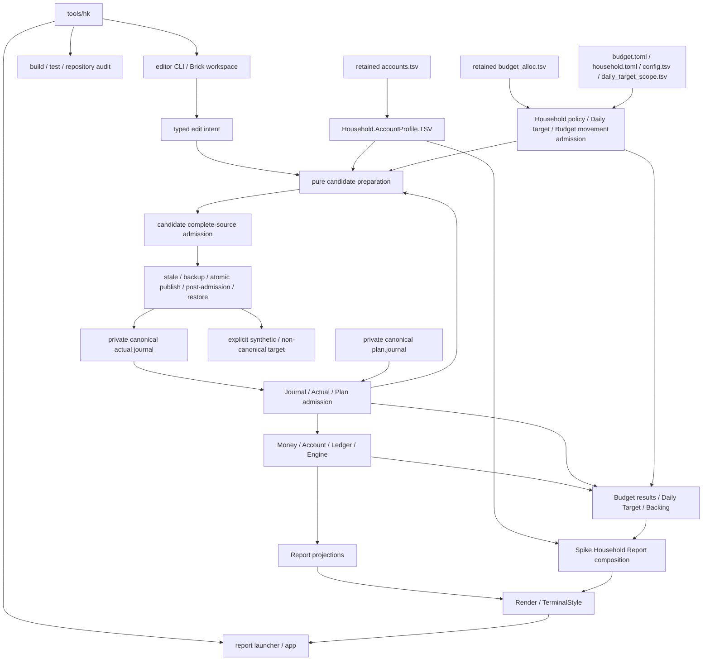

# h-kernel コードスコア

ステータス: アクティブな全体設計面  
更新日: 2026-08-07

## 1. この文書の役割

この文書は、`h-kernel`というリポジトリ全体を一度に眺めるためのスコアである。

現在どの声部が存在し、事実、policy、計算、Report、editor、表示、運用がどのように受け渡されているかを示す。同時に、各場所をどのようなコードへ育てたいか、まだ確定していない構成や短いコード案を鉛筆書きできる面でもある。

この文書が所有するのは次である。

- リポジトリ全体の現在の編成
- component、module群、source、toolのあいだを渡る主要な流れ
- 各領域に望む質感と育てる方向
- 全体を見ながら検討する設計スケッチと未解決の問い

この文書は、個別の厳密な契約を置き換えない。

- 会計上の不変条件と依存方向は[`ARCHITECTURE.md`](ARCHITECTURE.md)
- Haskellの書法は[`HASKELL_NATIVE_CODE_POLICY.md`](HASKELL_NATIVE_CODE_POLICY.md)
- editorの現在能力と次のsliceは[`EDITOR_DEVELOPMENT_PLAN.md`](EDITOR_DEVELOPMENT_PLAN.md)
- source topologyとwriter authorityは[`SOURCE_DATA_MIGRATION_PLAN.md`](SOURCE_DATA_MIGRATION_PLAN.md)
- Actual writer cutoverは[`ACTUAL_WRITER_CUTOVER_001.md`](ACTUAL_WRITER_CUTOVER_001.md)
- リポジトリ運用と文書寿命は[`REPOSITORY_POLICY.md`](REPOSITORY_POLICY.md)
- 公開データ境界は[`../SECURITY.md`](../SECURITY.md)

コードスコアは全体の関係を所有し、各partの契約はそのpartのownerが所有する。

## 2. 譜面上の記号

| 記号 | 意味 |
|---|---|
| **CURRENT** | `main`に実装され、現在のsource、build、test、文書から確認できる状態 |
| **DIRECTION** | 作者と合意した、育てたい性質または構成の方向 |
| **SKETCH** | 比較や実験のための未決定案。実装契約ではない |
| **QUESTION** | 全体を見たときに残っている問い。答えを推測で埋めない |

`SKETCH`は、コードへmergeされた時点で初めて`CURRENT`になり得る。採用しない案や役目を終えた案は通常文書へ堆積させず、削除してGit履歴へ戻す。

## 3. CURRENT: 現在の編成

### 3.1 Top-level score

| 場所 | CURRENTの役割 | 状態 |
|---|---|---|
| `src/` | exact accounting、Journal、Actual、Plan、Budget、Report、application config、rendering primitive | stable library |
| `household-src/` | Account profile admission、Household policy、Daily Target、Backing、Budget movement、Issue admission | stable library |
| `editor-src/` | typed edit intent、candidate preparation、source placement、safe writer、Actual workspace projection、UI-independent interaction | stable editor library |
| `spike-src/` | stable typed ownerを合成するHousehold Report compositionとrendering | active spike |
| `app/` | report CLIのfile、environment、stdout、exit boundary | delivery adapter |
| `editor-app/` | editor CLIのargument、preview、explicit commit、exit boundary | delivery adapter |
| `editor-tui-app/` | Actual workspaceのBrick event loop、pane、focus、rendering、effect delivery | delivery adapter |
| `tools/hk` | no-arg Actual workspaceとexplicit commandへのthin routing | daily doorway |
| `tools/` | repository audit、focused verifier、report verification | operations |
| `tests/` | module、component、effect、Report surface、repository ownershipのobservable contract | verification |
| `docs/` | policy、architecture、contract、observation、この全体スコア | documentation |
| external private source | canonical household fact、policy、retained compatibility source | not tracked |

### 3.2 Cabal components

```text
h-kernel
  source: src/
  owns: Account, Money, Ledger, Journal, Actual, Plan, Budget,
        Engine, Report, application config, rendering primitives

h-kernel-household
  source: household-src/
  depends on: h-kernel
  owns: AccountProfile, HouseholdPolicy, DailyTarget,
        HouseholdBacking, BudgetMovement, Issue admission

h-kernel-editor
  source: editor-src/
  depends on: h-kernel + h-kernel-household
  owns: edit intent, candidate preparation, source placement,
        complete-source admission, safe writer result,
        typed Actual workspace projection, UI-independent Actual add interaction

h-kernel-spike-household-report
  source: spike-src/
  depends on: h-kernel + h-kernel-household
  owns: provisional Household Report composition

executables
  app/             -> h-kernel report CLI
  editor-app/      -> h-kernel-editor-cli
  editor-tui-app/  -> Brick Actual workspace
```

## 4. CURRENT: 全体のデータ、計算、編集の流れ



この図は主要な受け渡しを示す。各parser、Report、editor commandの完全なcall graphではない。safe writerは明示されたpathだけへwriteする。current authorityではcanonical `actual.journal`と明示的rehearsal targetをh-kernel editorが扱い、他sourceのwriter authorityはActual cutover前のownerに残る。

## 5. CURRENTとDIRECTION: 各声部

### 5.1 正確な会計核

**CURRENT**

- `HKernel.Money`がCommodityごとのexact Quantityとcanonical `Balance`を所有する
- `Balance`はzero normalizationを維持し、lawfulな`Semigroup` / `Monoid`を公開する
- `HKernel.Account`がAccount identity、`AccountType`、Registryを所有する
- `HKernel.Ledger`がPostingとbalanced Transactionを所有する
- `HKernel.Engine`とinternal factsがReportへ渡す集計basisを作る

**DIRECTION**

正確さを孤立した硬さにしない。小さな型、名前のある変換、lawfulな組合せが互いを支え、sourceからReportまで意味を失わず流れる核にする。

### 5.2 Source admission

**CURRENT**

- Actual、Account、Planには名前付きJournal admissionがある
- BudgetとHousehold policyにはTOML admissionがある
- `HKernel.Household.AccountProfile.TSV`がretained `accounts.tsv`をstable typed profileへadmitする
- `HKernel.Household.BudgetMovement.TSV`がretained movement sourceをsource-independent factへadmitする
- Daily Target sourceはpolicy、obligation selection、reservation declarationへ分かれる
- parserはraw text、source coordinate、typed diagnosticを保持し、invalid valueを後段へ黙って流さない
- SpikeはAccount profile parserを再実装せず、stable admission resultを合成する

**DIRECTION**

人間が書くtextの揺れ、移行中のphysical shape、厳密なdomain admissionを同じ質感へ均さない。それぞれの難しさを適切な境界で受け止め、後段にはvalidated meaningを渡す。

### 5.3 BudgetとHousehold policy

**CURRENT**

- `HKernel.Budget.Config`が一般`BudgetPolicy`を作る
- `HKernel.Household.Config`と`HKernel.Household.Policy`がhousehold-specific coordinatesを所有する
- Consumption、Entitlement、Remainingはmain libraryのnamed ownerにある
- `HKernel.Household.DailyTarget`がeligible Asset、open obligation、reservation evidence、time coordinateを所有する
- `HKernel.Household.Backing`がEnvelope claim、funding、unassigned Budget、open Plan reserveを別座標として観察する

**DIRECTION**

fact、selected policy、validated policy、derived resultを別の声部として保ち、Account名やbalanceから意味を推測しない。

### 5.4 Household Report composition

**CURRENT**

- application config、Account profile admission、Household policy、Daily Target、Backing、Budget movement admissionはstable componentにある
- `HKernel.Spike.HouseholdReport`はstable ownerの値を一つのsurfaceへ合成する
- Spike-local Account parserとmetadata classifierは削除済みである
- Actual writer authorityはh-kernelへ移ったが、Report pathは引き続きread-onlyである

**DIRECTION**

残るcomposition responsibilityを、必要なinput contractが揃った時点でstable componentへ移す。Spikeという名前を消すだけの移動はしない。

### 5.5 Reportと表示

**CURRENT**

- `HKernel.Report`とnamed Report moduleがpure projectionを所有する
- `HKernel.Render`とdomain render moduleがText surfaceを構築する
- `HKernel.Render.TerminalStyle`がANSIとcharacter widthなどterminal physical detailを扱う
- Report snapshot系のANSI normalizationは`tools/report_sections.py`へ一本化されている

**DIRECTION**

calculation result、Report semantics、section composition、terminal physicsを分けながら、最終surfaceを断片の寄せ集めにしない。

### 5.6 Editorとwrite effect

**CURRENT**

- Actual append、multi-posting append、reverse、Account append、Budget movement、Issue、Plan add、Plan finishにnamed ownerがある
- candidateはpureに準備され、complete sourceへ戻してstrict admissionされる
- CLIはpreviewを常に表示し、explicit commitだけをsafe writerへ渡す
- safe writerはstale rejection、backup、atomic publication、post-admission、restore-capable failureを所有する
- Actual reverseはnew durable `event-id`とexplicit `reverses` relationを要求する
- `HKernel.Editor.Interaction.ActualAdd`がUI-independentなstate / action / transitionだけを所有する
- `HKernel.Editor.ActualWorkspace`がtyped AccountによるActual transaction projectionを所有する
- Brick pickerは選択Accountを`Account`のままInteractionへ渡し、display textをidentityにしない
- shared editor libraryからTUI-specific compatibility moduleは削除済みである
- canonical `actual.journal`のwriter authorityはh-kernel editorにある

**DIRECTION**

Editorを一つのprocedureへしない。intent、candidate、admission、publication、interactionを別の声部として保ち、会計意味をcore ownerへ返す。Brick、将来のHaskeline、その他adapterが必要な意味だけをdirect ownerから使える形を維持する。

### 5.7 Daily workspace doorway

**CURRENT**

```text
tools/hk
  no args         -> Actual workspace
  report          -> report launcher
  actual-add      -> Actual workspace with explicit Journal path
  actual-multi    -> editor CLI append
  actual-reverse  -> editor CLI reverse
  account         -> editor CLI account
  plan            -> editor CLI plan
  budget          -> editor CLI budget
  issue           -> editor CLI issue
  edit            -> editor CLI direct route
  check           -> build / test / repository audit
  help            -> usage
```

`tools/hk`はpath resolution、引数、exit statusを既存ownerへ渡す。domain calculation、candidate admission、mutation rule、audit ruleを所有しない。shell operation menu、gum / fzf selector、numeric menu fallbackは削除済みである。

**DIRECTION**

日常入口は小さく保つ。full-screen interactionはBrickなどのdelivery adapter、操作意味はshared typed ownerへ置き、shell routerへ別のnavigation modelを再び作らない。

### 5.8 Testと運用装置

**CURRENT**

- focused testとfull testがtyped ownerのobservable contractを検証する
- property testがBalance lawをmulti-commodity generated valueで観察する
- editor testがcandidate、interaction、stale、publication、restoreをsynthetic sourceで観察する
- repository auditがCabal source ownershipと`docs/INDEX.toml`を検査する
- daily-entrypoint verifierがnon-TTY rejection、explicit routing、argument preservation、path arity、error statusをsynthetic stubで観察する
- CIはpublic checkoutにprivate canonical sourceを要求しない
- Report contractとsnapshotがsurface compatibilityを検証する
- private non-canonical rehearsalは秘密を含まないoutcomeだけをevidenceとして残す

**DIRECTION**

検証を門番だけにせず、各声部が何を約束し、何を約束していないかを読めるevidenceにする。

## 6. 全体に求めるコードの豊かさ

良いコードを一つの音色へ均さない。

- boundaryの具体性、coreの厳密さ、policyの明示性、reductionの流れ、interactionの物理は異なる形を取ってよい
- abstract structureは具体的なdomain structureと対応させる
- 型だけ、短さだけ、point-freeの量だけを美しさの基準にしない
- 同じ意味を複数ownerが再構成しない
- 値がどこから来て、何へ変わり、どこで失敗し得るかを受け渡しから読めるようにする
- localな巧さより、隣り合うpartが互いの意味を保つ構成を優先する
- 読むことで学びが生まれることを歓迎するが、教材らしい見せ場のためにdomainを歪めない

豊かさは要素数ではなく、異なる要素が互いを消さず、必要な関係を結んでいることに置く。

## 7. 作曲机: 現在の設計スケッチ

以下は全体を考えるための鉛筆書きであり、採用済みの作業計画ではない。

### 7.1 Repository inventory

**CURRENT**

repository auditはCabal source ownershipとdocument indexを検査するが、root script、launcher、snapshot、top-level directoryのroleを一つのinventoryとして所有していない。

**SKETCH**

```toml
[[entries]]
path = "src"
role = "stable-domain-source"
owner = "h-kernel"

[[entries]]
path = "tools/hk"
role = "daily-router"
owner = "repository-operations"
```

**QUESTION**

- inventoryは全tracked fileを列挙するのか、top-level ownerだけを列挙するのか
- Cabal inventory、document index、root operations inventoryの重複をどう避けるか

### 7.2 External private source

**CURRENT**

fact、declaration、policy、note、compatibility source、execution configはpublic Gitの外にある一つのprivate canonical directoryへ置く。canonical `actual.journal`のwriterはh-kernel editorであり、bqn-ledgerとh-kernelはreaderである。他sourceのwriter authorityはActual cutoverで変更していない。

**DIRECTION**

source別の一つのwriter authorityとprivate boundaryを壊さず、fact、policy、compatibility surface、operation configを人間と機械が見分けられる構成にする。

**QUESTION**

- private source内のinventoryをどのrepositoryが所有するか
- BQN readerをcanonical Actual sourceへ向け続ける期間とreversal provenance対応をどう扱うか
- Plan、Budget、Issue sourceをどの順序で観察するか

### 7.3 Stable Household composition

**CURRENT**

source-specific admissionはstable ownerへ移った。SpikeにはHousehold Report compositionとrenderingが残る。

**SKETCH**

```text
named admitted values
  -> HouseholdReportInputs
  -> stable composition
  -> HouseholdReportSurface
```

**QUESTION**

- `HouseholdReportInputs`という一つのrecordがdomain grainを保つか
- stable compositionはmain `h-kernel`と`h-kernel-household`のどちらに属するか
- Backing pool別の不足と余剰を別surfaceとして公開する必要があるか

### 7.4 Display composition vocabulary

**CURRENT**

Reportごとのrender functionとterminal primitiveがfinal surfaceを構築する。

**SKETCH**

```haskell
renderSection
  [ heading title
  , metadata context
  , table columns rows
  , note explanation
  , status summary
  ]
```

これはDSL導入を決めるものではない。既存render codeのdomain差とrepetitionを先に観察する。

**QUESTION**

- 共通化すべきものはterminal primitiveか、Report sectionか、presentation policyか
- compact surfaceとhuman surfaceが共有する最小語彙は何か

### 7.5 会計値の組合せ

**CURRENT**

- `Balance`はCommodityごとのcanonical valueである
- `Balance`は`Semigroup` / `Monoid`と`negateBalance`を持つ
- `balanceFromAmounts`は`foldMap singletonBalance`、`sumBalances`は`fold`である
- TransactionとJournalは順序とidentityを保持し、必要なprojectionだけをBalanceへ落とす
- Matrix、Daily Target、Backingはnamed contributionをBalanceとして組み合わせる
- `Amount`、Transaction、Journal、Plan lifecycleへ同じinstanceを機械的に広げない

**QUESTION**

- Report factやBudget resultのどの結合が同じ観察文脈を保つか
- 可換projectionへ落とす前に保持すべき順序、identity、provenanceを型からどう読ませるか

### 7.6 Haskell機能の現在地

**CURRENT**

現在のmainでは、機能を網羅するためではなくdomain structureをコードから読めるようにするため、次のHaskell featureが使われている。

| Haskellの声部 | 現在対応しているdomain構造 |
|---|---|
| ADTとpattern matching | Account種別、command、period、load・validation・editor failureなど実在するcase |
| `newtype`、constructor隠蔽、smart constructor | Commodity、Quantity、Balance、Transaction、DateRange、identityのcanonical value |
| `Either`、`NonEmpty`、`do` notation | typed failure、空でないdiagnostics、前段のsuccessへ依存するadmission |
| `Semigroup`、`Monoid`、`Foldable`、`foldMap` | Balance、Flow、Matrix、Daily Target、Backingのlawful aggregation |
| parametric polymorphismと高階関数 | collection shapeに依存しないreductionとtyped basis |
| `traverse`とMap combinator | shapeとcoordinateを保つvalidation、projection、lookup、aggregation |
| pure coreとexplicit IO shell | accounting、policy、Report、candidate preparation、interactionと外界の分離 |
| `StateT LoadedFiles (ExceptT LoadError IO)` | include graph state、typed failure、file read effectの明示的な重なり |
| module abstraction | public facade、internal facts、stable component、spike、editor、application entryのownership |

point-free notationは変換方向がよく見える場所で使う一つの表記であり、使用量を美しさの尺度にしない。domain上の中間名や複数声部が見える場合はargument、`where`、record constructionを明示する。

**DIRECTION**

リポジトリ全体を、一つの書法へ均したfunction集ではなく、主題、反復、変奏、楽章、effect boundaryが読める大きな楽譜へ育てる。

```text
validated source
  -> canonical facts
  -> named domain basis
  -> named projection
  -> rendering

editor intent
  -> pure candidate
  -> complete-source admission
  -> explicit publication effect
```

**SKETCH**

| 候補 | 導入を検討するdomain上の兆候 |
|---|---|
| Applicative validation | independent validation errorを一度に蓄積したい |
| phantom type / DataKinds | preview、admitted、confirmed、published stageを実際に取り違え得る |
| GADT | commandごとにinputとresult typeの対応が異なる |
| custom typeclass / type family | 複数domainがsyntaxではなく同じlawとoperation setを共有する |
| optics | 深いrecord updateが主題を隠し、同じfocus operationが反復する |
| recursion scheme | 同じrecursive shapeのfoldとunfoldが複数ownerで重複する |
| effect abstraction | current capability recordやtransformer boundaryではeffect contractのreuse/testが明確に難しい |

これは未使用機能の不足表ではない。現在のADT、named pure function、standard typeclass、explicit effect boundaryがdomainを最も正確に表すなら、それが現在の正しい音である。

**QUESTION**

- input admissionにApplicativeなerror accumulationが自然なindependent validationはあるか
- editor lifecycle stageはcurrent typeで実際に取り違え可能か
- large moduleは新しい抽象より先に楽章分けを必要としているか
- source間の共通化候補は同じlawを共有するのか、処理順が似ているだけか

### 7.7 Actual workspace observation

**CURRENT**

canonical `actual.journal`のwriter authorityはh-kernel editorにあり、日常のno-arg `tools/hk`はpersistent Actual workspaceへ直接入る。Actual add interactionとAccount filterはUI-independent ownerを持ち、Brickはtyped Account selectionをdeliveryする。

**DIRECTION**

workspaceをBrick専用の意味体系へしない。Haskelineや別adapterが必要になったとき、Account identity、selection、interaction transition、candidate preparationを同じshared ownerから再利用できる形を保つ。一方でpane、cursor、focus、widgetなどdelivery固有の物理は無理に共通化しない。

**QUESTION**

- Brick `UIState`と`ActualAddMode`はinteraction stageを二重所有しているか
- Brick delivery contextのsource-byte retentionはsafe writer contractとどう対応するか
- Actual reverse target selectionをworkspaceのread-only interactionとして扱う必要があるか
- Plan、Budget、Issue sourceのwriter authorityを動かす必要があるか

次の有限sliceは[`EDITOR_DEVELOPMENT_PLAN.md`](EDITOR_DEVELOPMENT_PLAN.md)が所有する。

## 8. 新しいスケッチの書式

```markdown
### <対象領域>

**CURRENT**
現在のsource、owner、data flow、制約。

**DIRECTION**
全体の中で育てたい質感と役割。

**SKETCH**
未決定の構成、型signature、短いコード、比較案。

**QUESTION**
決定前に調べること、証拠が足りないこと。

**OWNER DOCUMENTS**
詳細な契約を所有する文書。

**POSSIBLE SLICE**
一つの有限な変更として試せる候補。着手決定ではない。
```

未合意の案を、作業指示やcurrent contractとして扱わない。

## 9. 同期規則

- 作業前にlatest `main`、open PR、parallel branch、target source、owner documentを確認する
- component、topology、domain ownership、major data flowが変わった場合、`CURRENT`を同じsliceで同期する
- `DIRECTION`は作者との合意が変わったときだけ更新する
- local function変更だけで全体scoreが変わらない場合、機械的に追記しない
- commit log、completed PR list、old migration procedureを蓄積しない
- detail contractが変わる場合は正規owner文書も更新する
- implementationと合わなくなった`CURRENT`、役目を終えた`SKETCH`、解けた`QUESTION`は剪定する

コードスコアは完成図ではない。現在演奏されている全体と、次に試せる数小節を、同じ視野へ置き続けるための面である。
